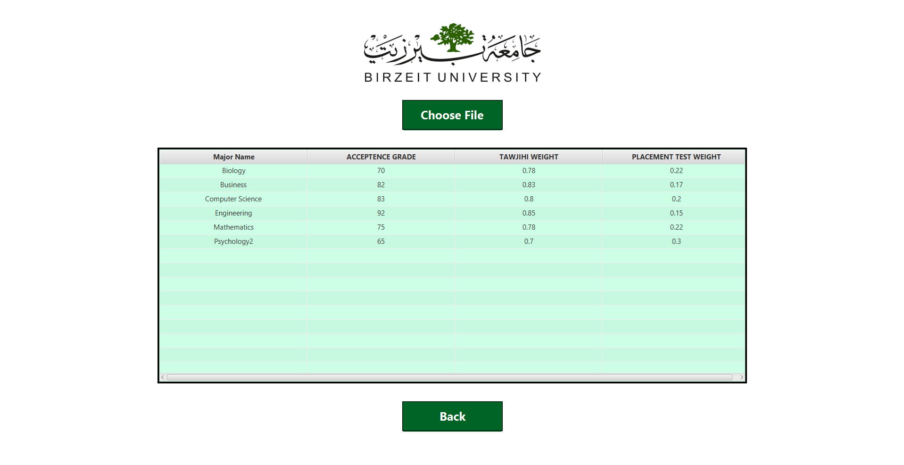
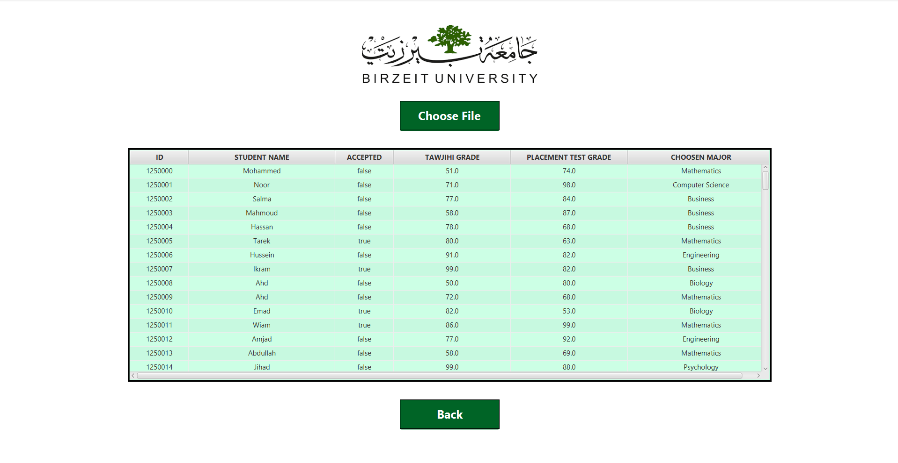
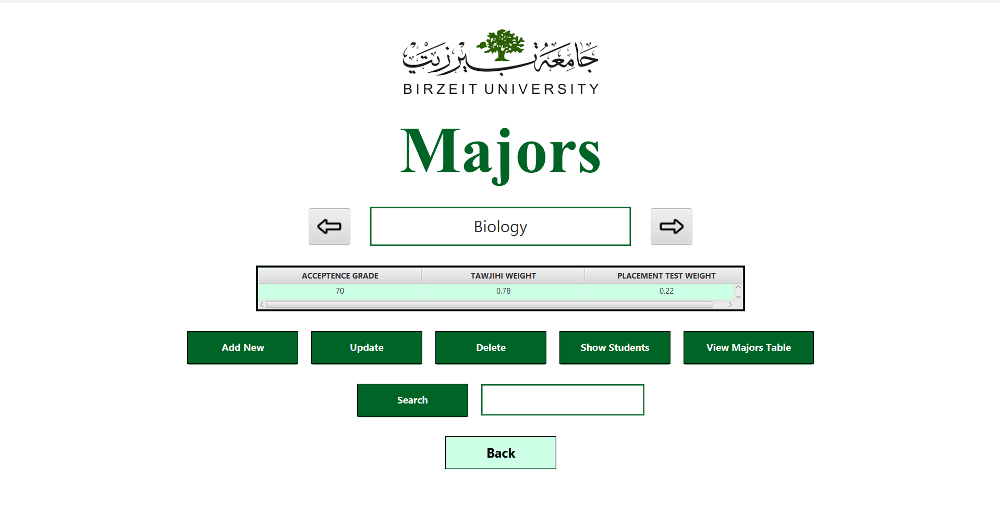
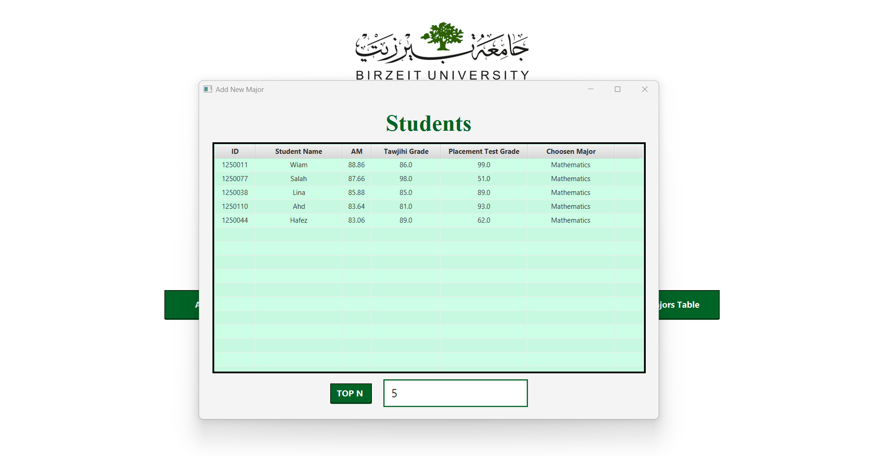
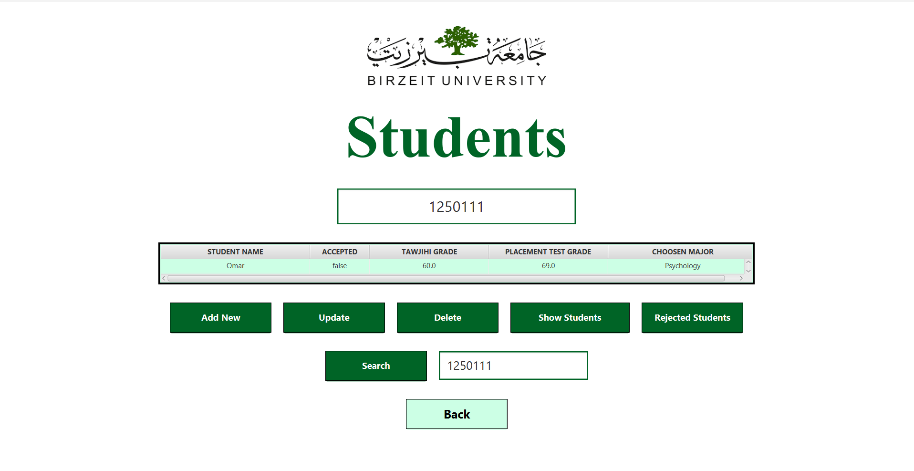
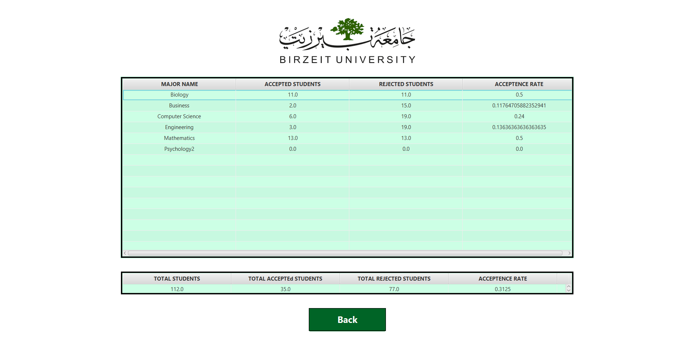
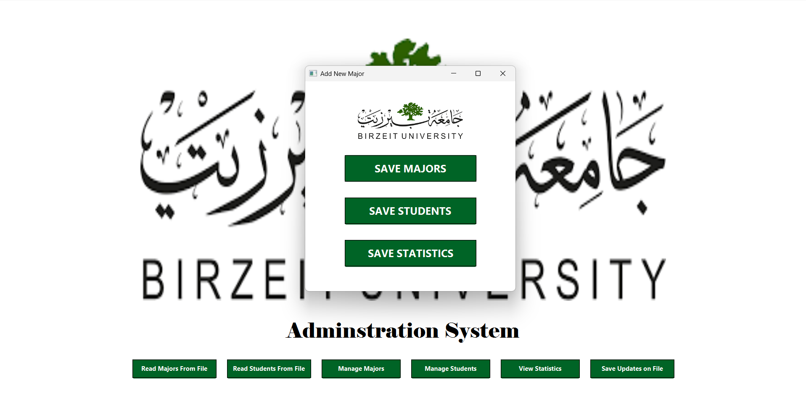

# 🎓 University Administration System

A Java-based desktop application built for managing university student admissions and major placements. Designed exclusively for administrative use, this system utilizes custom circular and doubly circular linked lists for efficient data handling.

## 🧠 Core Features

- **Student Admission Management**  
  Accept or reject students based on a custom equation and eligibility rules.

- **Major Placement Logic**  
  - Automatically checks if a student qualifies for their selected major.
  - If not eligible, suggests alternative majors based on calculated compatibility.

- **Custom Data Structures**  
  Implements:
  - Circular Linked Lists for students
  - Doubly Circular Linked Lists for majors

- **Admin-Only System**  
  Full access is restricted to authenticated university administrators.

## 🛠️ Tech Stack

- **Language**: Java
- **Data Structures**: Manually implemented circular & doubly circular linked lists
- **Application Type**: Desktop (JavaFX)

## 🧮 Admission Equation

A custom formula is used to evaluate students’ eligibility for different majors. 

## 📸 Screenshots










## ⚙️ How to Run

1. Clone the repository:
   ```bash
   git clone https://github.com/amalzaben/university-admin-system.git
